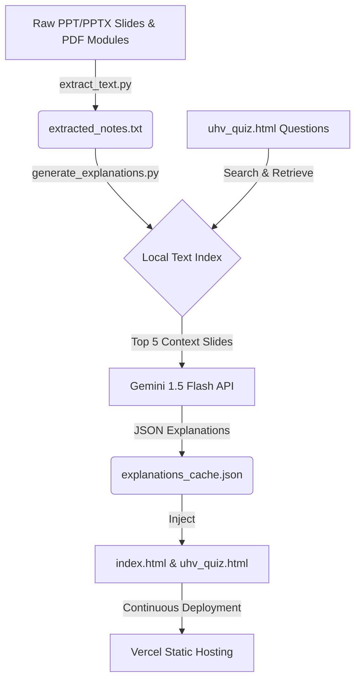

# 🧠 UHV Study Companion & RAG Pipeline
> **A high-intensity, exam-prep MCQ portal built under pressure with localized Retrieval-Augmented Generation.**

This repository contains a premium, interactive Multiple-Choice Question (MCQ) study companion for the course **Universal Human Values (BUHK408)**. It features 240+ questions complete with detailed explanations of why the correct option is correct and why incorrect options are wrong.

The explanations were compiled from PowerPoint slides and PDF modules using a custom, localized **Retrieval-Augmented Generation (RAG)** pipeline powered by Google's **Gemini 1.5 Flash**.

---

## 🚀 Architecture Workflow



---

## 📂 Project Structure

- **`index.html` / `uhv_quiz.html`**: A premium, fully responsive, glassmorphic frontend interface featuring:
  - Google Fonts (`Lora` for questions, `Plus Jakarta Sans` for controls).
  - Progress tracking bar with exam readiness percentage.
  - Interactive choice highlights (green for correct, red for incorrect).
  - Smooth slide-down explanation cards that show option-specific breakdowns.
  - Interactive filters for High-Priority questions and mistake tracking.
- **`extract_text.py`**: A parsing engine that scans the workspace for `.pdf`, `.pptx`, and older `.ppt` files. On Windows, it automatically launches PowerPoint COM Automation to extract text from old binary presentations, outputting `extracted_notes.txt`.
- **`generate_explanations.py`**: A localized RAG engine that:
  - Splits extracted notes into 1,160+ page/slide chunks.
  - Pre-tokenizes and indexes the chunks using set-overlap frequency search in Python.
  - For each question, retrieves the top 5 most relevant slides.
  - Queries `gemini-flash-latest` using REST transport with a 120s timeout in lightweight batches of 4 questions to prevent HTTP connection drops.
  - Logs unbuffered output in real-time and writes to `explanations_cache.json` for full task resume-on-failure support.
- **`requirements.txt`**: Python dependencies required to run the backend extraction and generation pipelines.

---

## 🛠️ How to Run & Build

### 1. Setup Environment
Install the dependencies:
```bash
pip install -r requirements.txt
```

### 2. Extract Course Material
Place all your lecture slides (`.ppt`/`.pptx`) and PDF modules in the root folder, then run:
```bash
python extract_text.py
```
This produces `extracted_notes.txt` (a text database mapping slide titles to slide body texts).

### 3. Generate Explanations (RAG Pipeline)
Get a free Gemini API key from [Google AI Studio](https://aistudio.google.com/), set it in your environment, and run the pipeline:
```powershell
# PowerShell (Windows)
$env:GEMINI_API_KEY="your-api-key-here"
python -u generate_explanations.py
```
This runs the local search retriever, queries Gemini in batches of 4 questions, writes to `explanations_cache.json`, and finally injects the completed explanations directly back into the HTML file.

---

## ⚡ Deployment to Vercel

The portal is designed to run entirely client-side. The compiled HTML file contains all questions and explanations embedded inline, meaning it requires **zero databases, zero APIs, and zero backend servers at runtime**.

To host the portal:
1. Initialize the repository:
   ```bash
   git init
   git remote add origin https://github.com/VK-10-9/uhv.git
   git branch -M main
   git add .
   git commit -m "feat: setup RAG-powered MCQ portal"
   git push -u origin main
   ```
2. Go to **[Vercel Dashboard](https://vercel.com/dashboard)**.
3. Import the repository `VK-10-9/uhv`.
4. Set the Framework Preset to **Other** (static deployment) and click **Deploy**.

Vercel will build and serve your portal instantly at a custom sub-domain. Any future updates pushed to `main` will trigger automated redeployments.
