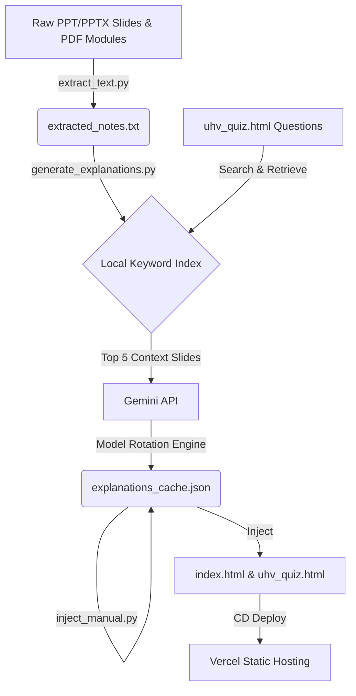

# 🚨 UHV Exam Companion & RAG Pipeline (BUHK408)
> **246/246 MCQs Fully Annotated • Local RAG Pipeline • Emergency Exam Cheatsheet**

[](https://uhv.vishwadev.tech/)
[](https://uhv.vishwadev.tech/)
[](https://uhv.vishwadev.tech/)

This repository is a **high-intensity, exam-prep MCQ portal** built under extreme pressure for the **Universal Human Values (BUHK408)** exam. It couples a premium, responsive glassmorphic web companion with a localized **Retrieval-Augmented Generation (RAG)** pipeline that extracts notes from PDF modules and lecture slides using Gemini 1.5 Flash.

---

## ⚡ Emergency UHV Exam Cheatsheet (2-Minute Revision)

*Studying last-minute? Here are the core UHV concepts you need to pass tomorrow's exam:*

### 1. Basic Human Aspirations
* **Continuous Happiness (Sukha)**: A state of harmony at all levels of living. It is a qualitative, continuous need of the Self (`I`).
* **Prosperity (Samridhi)**: The feeling of having *more* than required physical facilities. It requires (1) assessment of physical needs, and (2) production/assurance of more than needed.
* **Modern Misconception**: Confusing **Suvidha** (physical facility/pleasure) with **Sukha** (happiness). Physical facilities are temporary and quantitative; happiness is continuous and qualitative.

### 2. Co-existence of Self (`I`) and Body
| Feature | Self (`I`) | Body |
| :--- | :--- | :--- |
| **Type** | Conscious (Chetana) | Material (Jada) |
| **Needs** | Qualitative (Respect, Trust, Happiness) | Quantitative (Food, Clothing, Shelter) |
| **Duration** | Continuous | Temporary / Periodic |
| **Activities** | Desiring, Thinking, Selecting, Analyzing | Breathing, Eating, Walking, Heartbeat |
| **Fulfillment** | Right Understanding & Right Feelings | Physical Facilities (Suvidha) |

### 3. Four Levels of Harmony
1. **Harmony in the Self**: Aligning desiring, thinking, and selecting. Resolving inner conflicts.
2. **Harmony in the Family**: Established through right feelings/values in relationships.
3. **Harmony in the Society**: Fearlessness (Abhaya), trust, and co-existence in all families.
4. **Harmony in Nature/Existence**: Mutual fulfillment (Paraspar Purakata) among the four orders.

### 4. Nine Values in Relationships
1. **Trust (Vishwas - FOUNDATIONAL VALUE)**: The assurance that the other person wants my happiness and well-being.
2. **Respect (Samman)**: Right evaluation (neither over-evaluating, under-evaluating, nor otherwise-evaluating).
3. **Affection (Sneha)**: Acceptance of the other as being related to me.
4. **Care (Mamata)**: Feeling of responsibility to nurture and protect the body of the relative.
5. **Guidance (Vatsalya)**: Feeling of responsibility to nurture the self of the relative with right understanding.
6. **Reverence (Shraddha)**: Acceptance of excellence in others.
7. **Glory (Gaurav)**: Feeling of honor for those who have made effort for excellence.
8. **Gratitude (Kritagyata)**: Feeling of honor for those who have helped me in my development.
9. **Love (Prema - COMPLETE VALUE)**: The feeling of being related to all human beings and everything in existence.

### 5. Four Orders of Nature
1. **Material Order (Padartha Avastha)**: Soil, water, stones. Activity: Composition/Decomposition.
2. **Pranic Order (Prana Avastha)**: Plants, trees. Activity: Respiration, growth.
3. **Animal Order (Jiva Avastha)**: Animals. Co-existence of Self (`I`) and Body. Conduct is breed-defined.
4. **Human Order (Gyana Avastha)**: Humans. Co-existence of Self (`I`) and Body. Conduct is value-defined (Right Understanding).

---

## 🛠️ Project Architecture



### Key Technical Engineering:
1. **Local Search Index (RAG)**: Notes are parsed into 1,165 slide-level chunks. The generator performs TF-IDF term-overlap checks to pull the top 5 most relevant slides per question, minimizing Gemini API context payloads (~9k tokens per request) to prevent quota drops.
2. **Model Rotation Engine**: Bypasses the 20-request daily limit of free-tier Google AI Studio projects. If the script detects a `429 Quota Exceeded` error, it automatically rotates model families:
   $$\text{gemini-flash-latest} \longrightarrow \text{gemini-2.5-flash} \longrightarrow \text{gemini-2.0-flash} \longrightarrow \text{gemini-2.0-flash-lite}$$
3. **Watchdog Process Wrapper**: Runs the generator in a subprocess. On Windows, if a network socket hangs or is throttled (common on Windows Defender), the watchdog detects the stagnation (no cache modifications for 260 seconds), terminates the process, and resumes from the JSON cache automatically.

---

## 💻 Running it Locally

### 1. Install Requirements
```bash
pip install -r requirements.txt
```

### 2. Extract Lecture Slides
Compile raw modules and presentations into a text database:
```bash
python extract_text.py
```

### 3. Run Generator
Run the watchdog wrapper with your Gemini API key:
```powershell
$env:GEMINI_API_KEY="your-key-here"
python -u run_generator.py
```

---

## 🎨 Interactive Portal Features
* **Progress Readiness Bar**: Tracks your exam readiness based on correct answers.
* **Collapsible Cards**: Clicking options drops down specific rationale for **why** it is correct or incorrect.
* **Mistake Filters**: Tracks wrong choices in real-time, allowing you to filter and practice only your weakest questions.
* **Clean Fonts & Glassmorphism**: Utilizes `Lora` and `Plus Jakarta Sans` for readability under late-night study pressure.

*Good luck with the exam tomorrow! 🚀*
